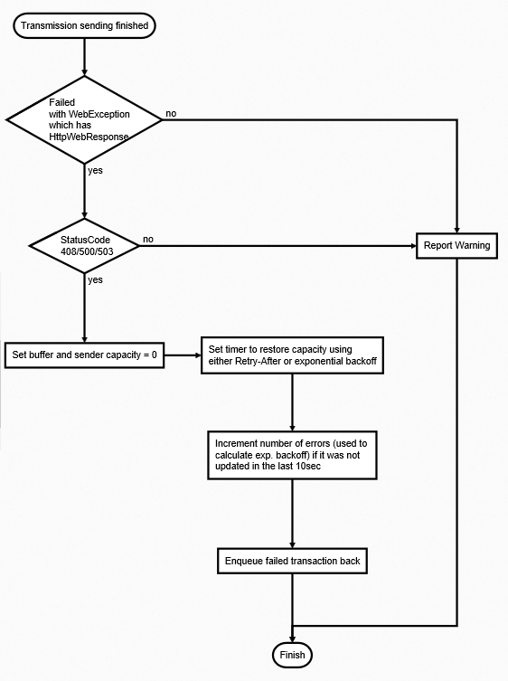
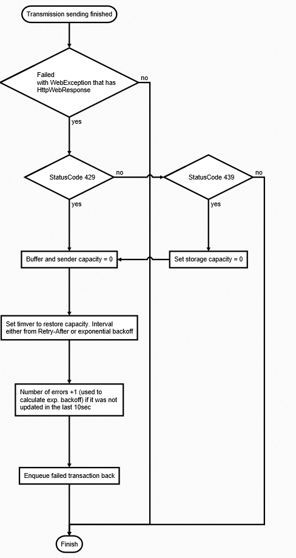
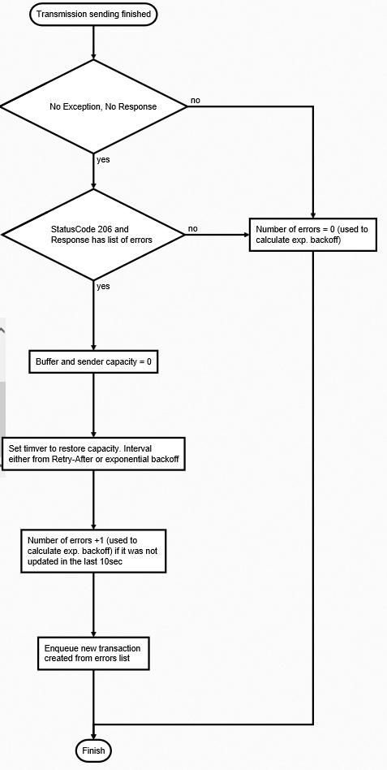

This document was last updated 7/14/2016 and is applicable to SDK version 2.2-beta1.

# Server Telemetry Channel Error Handling 

## Introduction

When channel finishes sending transmission (a serialized and compressed batch of telemetry items) out an event is generated.
There are several transmission policy classes that subscribe to this event. These policies get exception information and response from event's arguments. If policy decides to modify channel behaviour it sets sender, buffer or storage capacity to 0. (For example, if it changes sender and buffer capacity to 0 all new data will go to storage till we reach disk size limit). 

There is also another set of policies that subscribe to a different events and also change sender, buffer and storage capacities to influence how channel behavies.

### Supported Status codes

* 206  - partial success (some items from the batch were not accepted, response contains more details)
* 408 - request timeout
* 429 - too many requests
* 439 - too many requests over extended time
* 500 - server error
* 503 - service unavailable

### Partial success (206) response format

```
{
    "itemsReceived": 2,
    "itemsAccepted": 1,
    "errors": [
        {
            "index": 0,
            "statusCode": 400,
            "message": "109: Field 'startTime' on type 'RequestData' is required but missing or empty. Expected: string, Actual: undefined"
        }
    ]
}
```

### [ErrorHandlingTransmissionPolicy](https://github.com/Microsoft/ApplicationInsights-dotnet/blob/master/src/TelemetryChannels/ServerTelemetryChannel/Shared/Implementation/ErrorHandlingTransmissionPolicy.cs)

Notes:
* This policy handles failures with status codes 408, 500, 503
* "Set timer to restore capacity using Retry-After or exponential backoff" means that
	* We check that Retry-After header is present. In the header we expect to get TimeSpan. Timer is set to restore capacity after this interval. (Note that with current backend implementation Retry-After is never returned for 408, 500, 503). 
	* If Retry-After header is not present we check how many consecutive errors occured so far and use exponential backoff algorythm to set a timer to restore capacity. Exponential backoff algorythm description: http://en.wikipedia.org/wiki/Exponential_backoff	
* We do not update number of consecutive errors if it was recently updated because we have mupliple sender that most likely to fail at the same time for intermittent issues.
	


### [ThrottlingTransmissionPolicy](https://github.com/Microsoft/ApplicationInsights-dotnet/blob/master/src/TelemetryChannels/ServerTelemetryChannel/Shared/Implementation/ThrottlingTransmissionPolicy.cs)

Notes:
* This policy handles failures with status codes 429, 439
* With current backend implementation for 429 we get Retry-After header, and 439 is not used.



### [ThrottlingTransmissionPolicy](https://github.com/Microsoft/ApplicationInsights-dotnet/blob/master/src/TelemetryChannels/ServerTelemetryChannel/Shared/Implementation/PartialSuccessTransmissionPolicy.cs)

Notes:
* This policy handles status code 206 and case when there is no failure and no response (success case)



### [NetworkAvailabilityTransmissionPolicy](https://github.com/Microsoft/ApplicationInsights-dotnet/blob/master/src/TelemetryChannels/ServerTelemetryChannel/Shared/Implementation/NetworkAvailabilityTransmissionPolicy.cs)

This policy subscribes to the [network change event](https://msdn.microsoft.com/en-us/library/system.net.networkinformation.networkchange.networkaddresschanged%28v=vs.110%29.aspx?f=255&MSPPError=-2147217396). When network becomes unavailable sender and buffer capacity are set to 0. Note that consecutive errors count that affects exponental backoff logic is not changed.

### [ApplicationLifecycleTransmissionPolicy](https://github.com/Microsoft/ApplicationInsights-dotnet/blob/master/src/TelemetryChannels/ServerTelemetryChannel/Shared/Implementation/ApplicationLifecycleTransmissionPolicy.cs)

This policy subscribes uses [IRegisteredObject](https://msdn.microsoft.com/en-us/library/system.web.hosting.iregisteredobject(v=vs.110).aspx) to get notification when application is stopping. When application is stopping sender and buffer capacity are set to 0. Note that consecutive errors count that affects exponental backoff logic is not changed.
